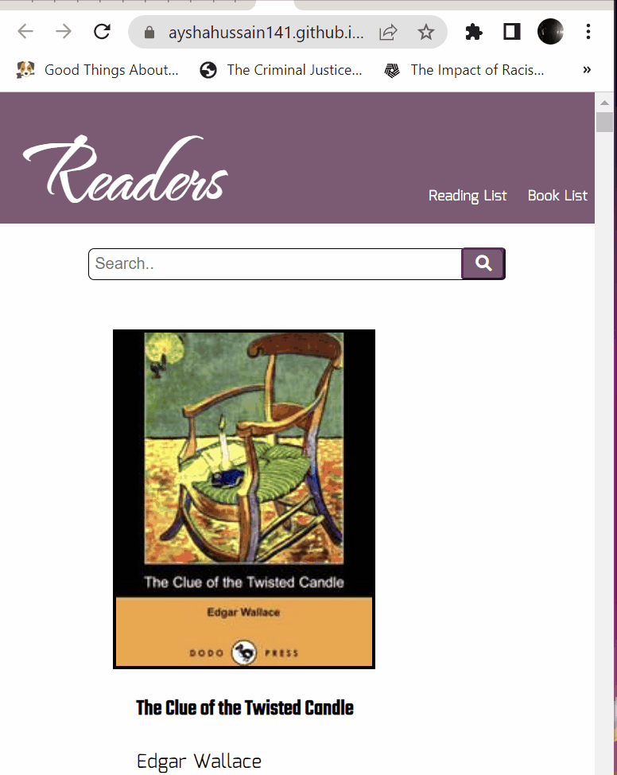

# 📖Readers

Readers is a web application for bookworms who want to keep track of the books which they store in a reading list. The application uses an public API called Open Library which is an API that is a catalog of metadata about books. The goal of the API is to hold data about every book that has been published.

This application was inspired by goodreads where user can add books they want to read in the future in a reading list.

# Live Link
https://ayshahussain141.github.io/ajax-project/
# Technologies Used
HTML

CSS

JavaScript

AJAX

# Feature List
* User can view a list of books
* User can add a book to readig list
* User can view reading list
* User can delete list item
* User can search for a book

# Demo
* User searching for a book and adding to reading list

# Stretch features
* View book list based on genre

# Getting Started
index.html
* css (directory)
  * styles.css
* js(directory)
  * data.js
  * main.js

# Open ibrary
Get familiar with Open library
